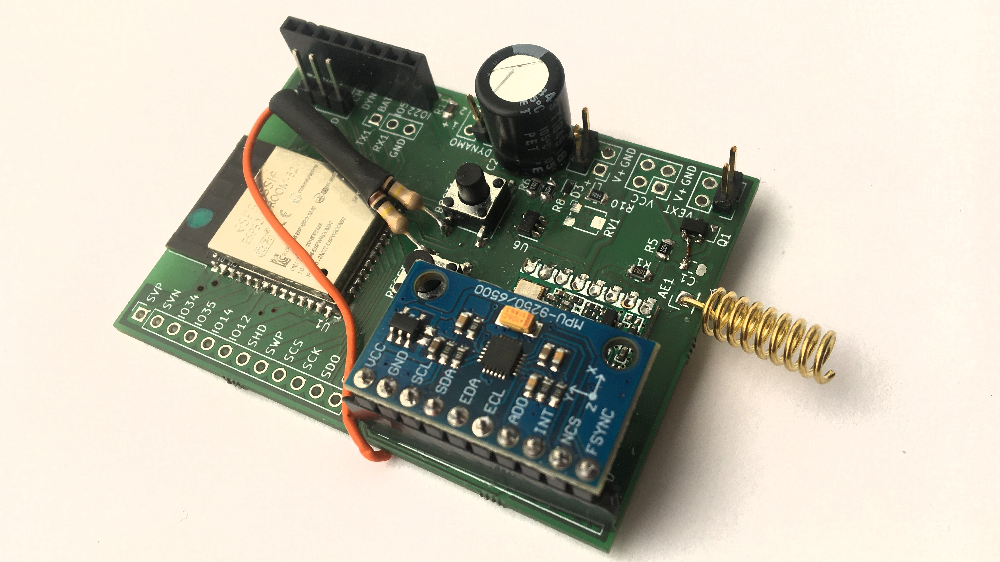

# Feuchtraumabzweigdose

This PCB is meant to function as an experimental playground for the [OpenBike](https://ulm.dev/projects/openbike/) project. It integrates WiFi and Bluetooth via the ESP32 MCU and LoRaWAN through the ubiquitous RFM95W modem. It also has a dedicated header for a gyro module as well as a switchable power supply for GNSS/GPS modules that can be switched off for deep sleep. It exposes a shared SPI bus, two serial lines and all unused pins of the ESP32, with several RTC interrupt methods available in hardware. A dedicated dynamo-to-Li+ charger as well as an efficient 3.3V LDO to supply the logic can be populated optionally. 

All in all it is an attempt to migrate most of the functionality of a TTGO T-Beam while being able to run days or weeks on end on one 18650 cell while mostly being in deep sleep. The T-Beam will usually deplete the cell within 30 hours.

For full functional documentation see [`docs/feuchtraumabzweigdose_docs.pdf`](docs/feuchtraumabzweigdose_docs.pdf).

The project is named Feuchtraumabzweigdose because it is meant to fit snugly into a waterproof junction box – or Feuchtraumabzweigdose in German :D

## Known issues in v0.1

* stk forgot the pullup resistors on the BOOT and RESET buttons respectively. This can be mitigated through botch wire.
* ~stk probably also forgot a pulldown resistor for the interrupt on the MPU9250 breakout header. Botch wire, again.~ When using the MPU9250 as a wakeup source, at least within the Arduino framework for quick and dirty first prototyping, apparently you have to actively wait for a bit between setting an external wakeup source and actually putting the device to sleep.
* as of now, the circuit has no undervoltage protection for the 18650. Use protected cells, if possible
* The voltage divider that is meant to be read by the ADC is 1:10, which brings down the measurable range of values quite a bit. Replace R3 with a 1M resistor to bring it down to a simple 1:1 divider, but this also increases the power draw during deep sleep.
* The 10k resistor at the MCP73832's `PROG` pin (R2) limits charging current to 100mA. ~Might want to replace this with maybe a 2k resistor (500 mA) or something in between~ This should not be increased too much
* in v0.1, the MOSFET switching the external power for the GPS (Q1) has pins 2 and 3 switched. A quick fix is to rotate it 180 degrees and switch the Source and Drain pins, then connect the Gate pin to one pad of the unpopulated C1 at the R1/R5 junction. See [this image for reference.](docs/botch-q1.jpg)
